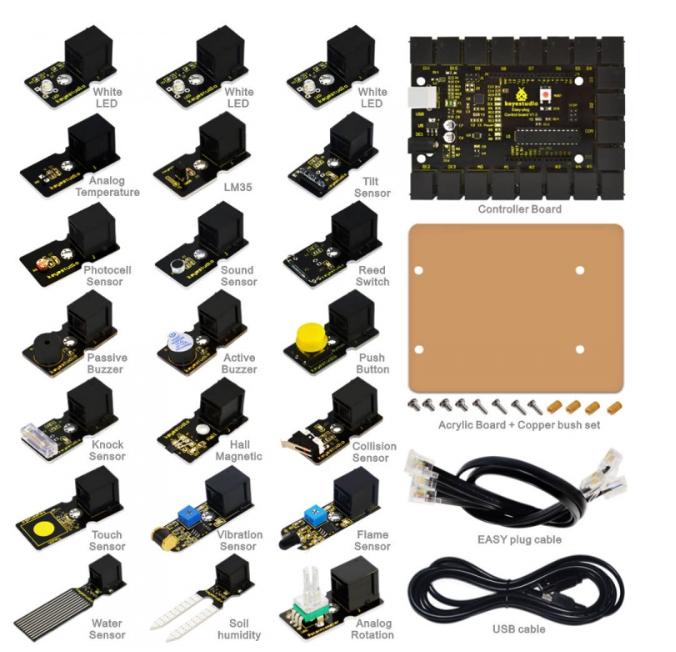
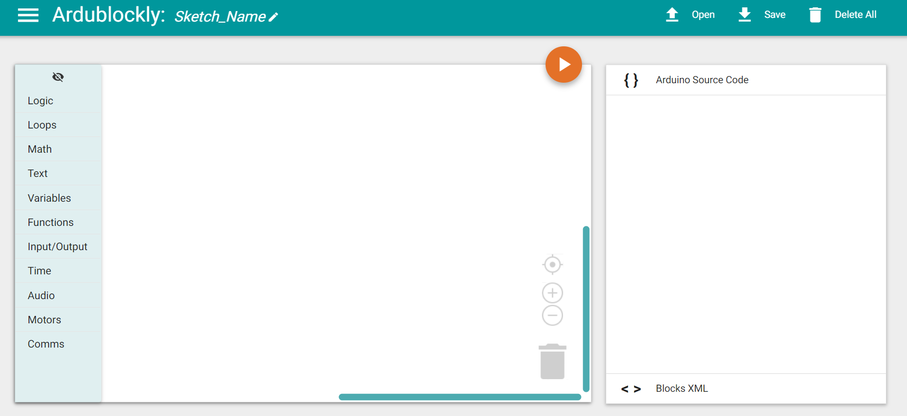
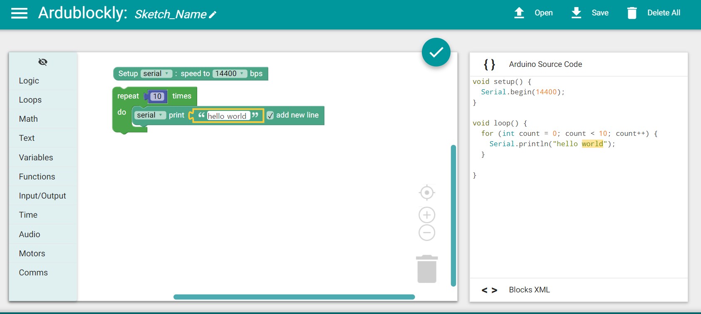
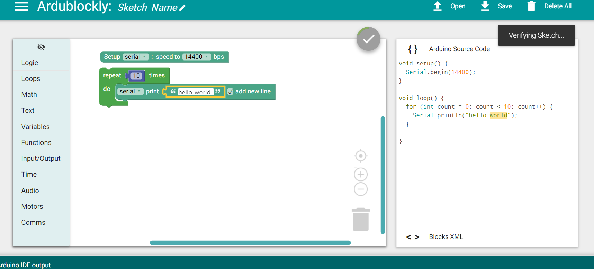
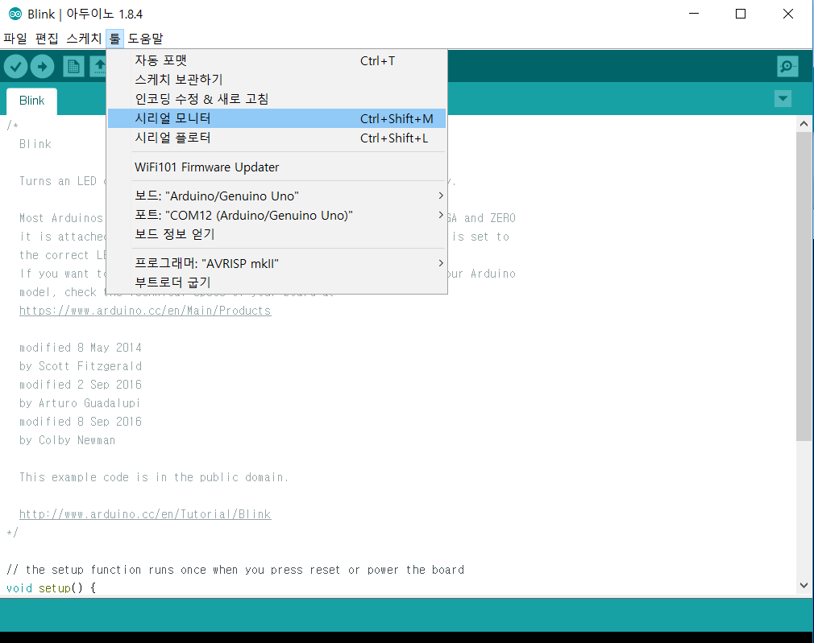

Chapter 1 : Hello world
===================================

IoT 센서는 다음 센서 모듈을 기반으로 한다.
IoT 센서에 대한 회로 구성과정은 쉽지 않은 과정이지만 간단한 원리를 이해하는게 목적이기때문에
Easy Plug 모듈을 사용하고 이후에 좀더 확장된 센서 모듈도 있다.

1.1 blockly and arduino IDE
------------------------------------------------------------

block 프로그램과 아두이노 IDE와 병행을 할것이다.
arduino block 프로그램은 다음과 같다.

1. https://github.com/carlosperate/ardublockly.wiki.git

windows용 다운로드 링크 :
http://ardublockly-builds.s3-website-us-west-2.amazonaws.com/index.html?prefix=windows/
또는

git clone https://github.com/carlosperate/ardublockly.git

cd ardublockly

git submodule update --init --recursive

2. https://github.com/BlocklyDuino/BlocklyDuino

1번을 PC에 셋업해서 실행시키면 다음 화면이 뜬다.

Arduino IDE는 다음 사이트에서 받으면 된다.

https://www.arduino.cc/en/Main/Software

자 프로그램을 시작해 보자.
아두이노 보드에 프로그램을 다음처럼 올리면 PC에서 시리얼 통신으로 통신을 할 수 있다.

.. code-block:: python

    int val;// define variable val
    void setup()
    {
      Serial.begin(9600);// set the baud rate at 9600 to match the software settings. When connected to a specific device, (e.g. Bluetooth), the baud rate needs to be the same with it.
    }
    void loop()
    {
      val=Serial.read();// read the instruction or character from PC to Arduino, and assign them to Val.
      if(val=='R')//  determine if the instruction or character received is “R”
      {  // if it’s “R”
       Serial.println("Hello World!");// display “Hello World!”
      }
    }

block 프로그램을 해보자.

블락 프로그램을 업로드 하게 되면 다음 그림처럼 나온다.
ServerCompilerSettings.ini 설정에서 포트 번호와 Arduino IDE 경로를 확인하고 업로드 하길 바란다.

업로드가 완료가 되면 다음처럼 Arduino IDE에서
시리얼 모니터링을 열면 된다.
통신속도는 아두이노 프로그램에서 한 통신속도와 맞추면 된다.
너무 빠른 속도로 출력되면 타이머 1초정도를 주면 천천히 나온다.

시리얼 모니터에서는 다음처럼 Hello World가 1초 간격으로 찍힌다(1초 딜레이를 줬을경우)