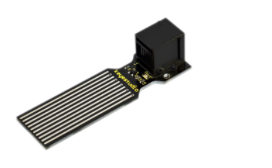
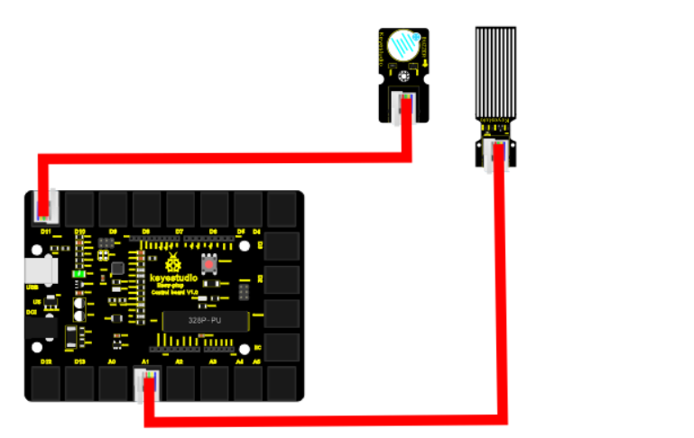
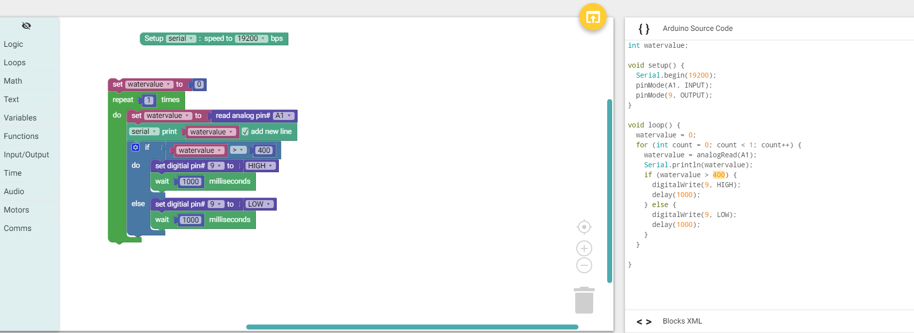

chapter 10: Water level alarm
========================================

물의 깊이를 측정하는 센서이다.
물에 깊이에 따라서 알람을 울려주도록 한번 해보자.

10.1 준비물
-------------------------
액티브 부저와 워터센서를 이용해 보자.
워터 센서는 물의 깊이와 물에 빠진것을 확인하는 센서이다. 기다란 센서 라인을 통해 물의 양을 측정하게 되는것이다.

EASY plug controller Board *1
EASY plug cable *2
USB cable *1
EASY plug Active Buzzer Module *1
EASY plug Water Sensor *1

스펙은 다음과 같다.

Operating voltage: DC5V
Operating current: ﹤20mA
Sensor type: Analog
Detection area: 40mm x16mm
Humanized design: Anti-slippery semi-lunar recess
Operating temperature: 10%~90% without condensation
Size: 68.3 x 20mm
Weight: 5g

10.2 연결 설정
------------------------

다음처럼 보드의 D2~13 임의의 포트에 끼워주면 된다.
부저 포트는 9번을 사용하도록 하자.
아날로드 센서인 워터센서는 A1을 사용하도록 하자.

10.3 code
------------------------
블락코드는 다음과 같다.

아두이노 코드는 다음과 같다.
시리얼로 연결해서 값을 찍어 보면 적절히 물센서 값에 따라서 동작을 해야 한다.

.. code-block:: python

    int watervalue;

    void setup() {
      Serial.begin(19200);
      pinMode(A1, INPUT);
      pinMode(9, OUTPUT);
    }

    void loop() {
      watervalue = 0;
      for (int count = 0; count < 1; count++) {
        watervalue = analogRead(A1);
        Serial.println(watervalue);
        if (watervalue > 400) {
          digitalWrite(9, HIGH);
          delay(1000);
        } else {
          digitalWrite(9, LOW);
          delay(1000);
        }
      }

    }

