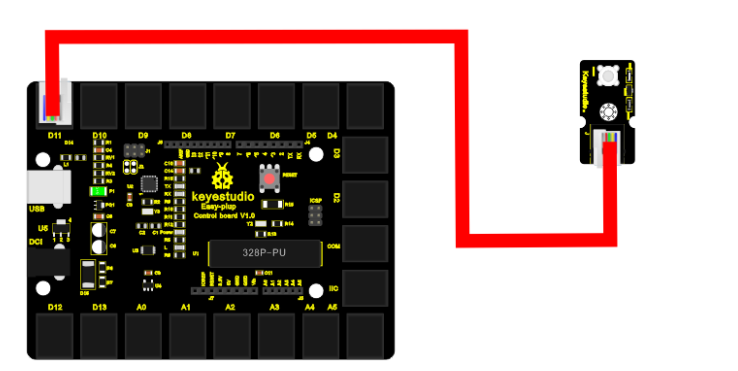

chapter 11: I'm thirsty
========================================

LED 센서를 이용해 보자.
LED는 Digital Type으로 1 신호가 오면 켜지고 0 이 오면 커지는 특성을 가진다.

.. image:: ./img/chapter2-1.png

2.1 준비물
-------------------------

EASY plug controller Board *1
EASY plug cable *1
USB cable *1
EASY plug Digital White LED Module *1

2.2 연결 설정
------------------------

다음처럼 보드의 D2~13 임의의 포트에 끼워주면 된다.
여기서는 11번 포트로 설정해 보자.

