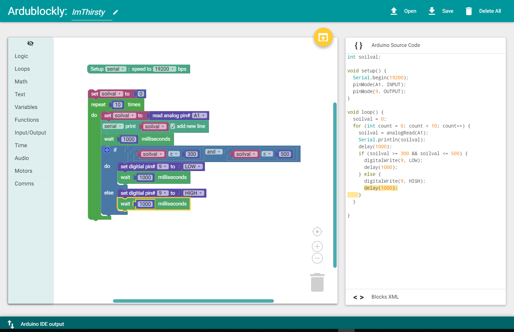

chapter 11: I'm thirsty
========================================

토양 습도 센서를 이용해 보자.
이 센서는 토양의 습기를 측정해서 토양의 마른 상태를 측정하는 센서이다.

2.1 준비물
-------------------------

EASY plug controller Board *1
EASY plug cable *2
USB cable *1
EASY plug Active Buzzer Module *1
EASY plug Soil humidity Sensor *1

센서의 스펙은 다음과 같다.

Power Supply Voltage: 3.3V or 5V
Working Current: ≤ 20mA
Output Voltage: 0-2.3V (When the sensor is totally immersed in water, the voltage will be 2.3V), the higher humidity, the higher the output voltage
Sensor type: Analog output

2.2 연결 설정
------------------------

디지털 포트로 패시브 알람은 9번을 이용하고
아날로드 토양습도 센서는 A1을 이용해 보자.

11.3 code
------------------------
블락코드는 다음과 같다.

아두이노 코드는 다음과 같다.
시리얼로 연결해서 값을 찍어 보면 적절히 토양센서 값에 따라서 동작을 해야 한다.

.. code-block:: python

    int soilval;

    void setup() {
      Serial.begin(19200);
      pinMode(A1, INPUT);
      pinMode(9, OUTPUT);
    }

    void loop() {
      soilval = 0;
      for (int count = 0; count < 10; count++) {
        soilval = analogRead(A1);
        Serial.println(soilval);
        delay(1000);
        if (soilval >= 300 && soilval <= 500) {
          digitalWrite(9, LOW);
          delay(1000);
        } else {
          digitalWrite(9, HIGH);
          delay(1000);
        }
      }

}

