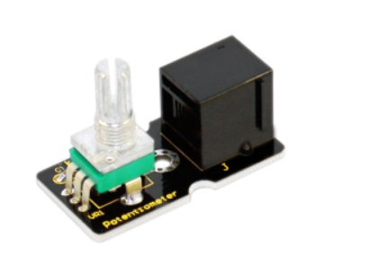
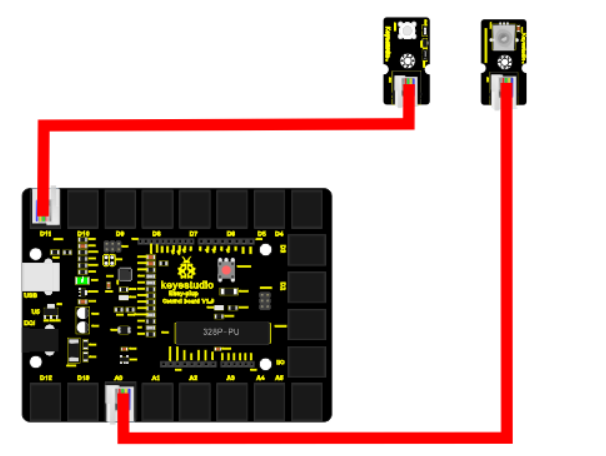
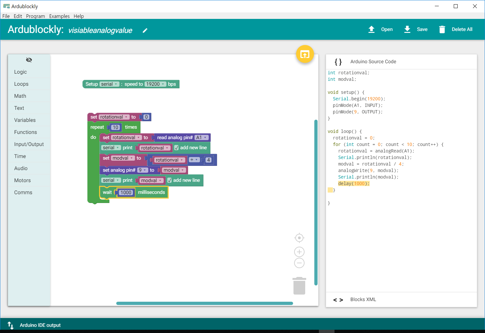

chapter 12: Visible analog value
========================================

이 장에서는 아날로그 로테이션 센서를 LED 밝기를 조정하는 실습을 해보자.
아날로드 로테이션 센서는 전위차계를 기초로 하고 있다. 전압은 1024값으로 나위어져 있고 회전에 따라 값이 변하게 되어 있다.

12.1 준비물
-------------------------

EASY plug controller Board *1

EASY plug cable *2

USB cable *1

EASY plug Digital White LED Module *1

EASY plug Analog Rotation Sensor *1

12.2 연결 설정
------------------------

디지털 LED를 9번 포트에
아날로드 로테이션 센서를 A1 에 연결해 보자.

12.3 code
------------------------
블락코드는 다음과 같다.

아두이노 코드는 다음과 같다.
시리얼로 연결해서 값을 찍어 보면 적절히 아날로드 로테이션 센서 값에 따라서 LED가 동작을 해야 한다.

.. code-block:: python

    int rotationval;
    int modval;

    void setup() {
      Serial.begin(19200);
      pinMode(A1, INPUT);
      pinMode(9, OUTPUT);
    }

    void loop() {
      rotationval = 0;
      for (int count = 0; count < 10; count++) {
        rotationval = analogRead(A1);
        Serial.println(rotationval);
        modval = rotationval / 4;
        analogWrite(9, modval);
        Serial.println(modval);
        delay(1000);
      }

    }

