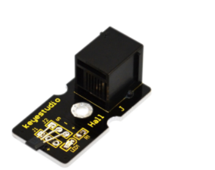
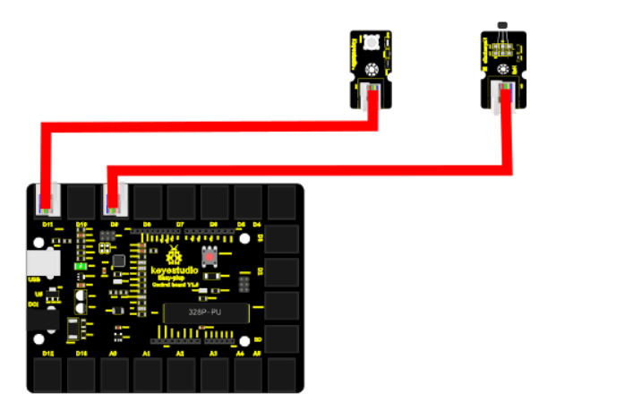
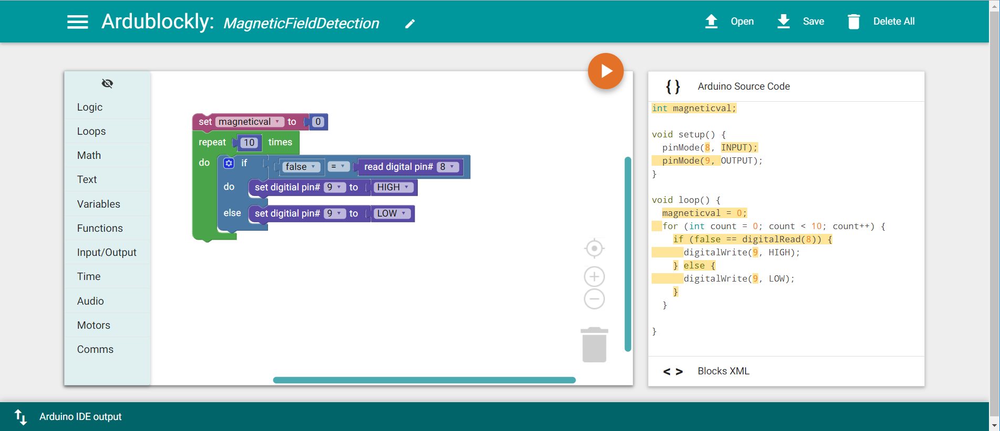

chapter 13: Magnetic field detecting
========================================

지구는 자기장으로 둘러 쌓여 있다. 가장 중요한 역할을 하지만 일상적으로 느끼지 못하는것이다.
이 장에서는 자기장을 어떻게 센서링 하는지 알아보도록 하자.

13.1 준비물
-------------------------

EASY plug controller Board *1
EASY plug cable *2
USB cable x1
Magnetic-iron *1 (not included)
EASY plug Digital White LED Module *1
EASY plug Hall Magnetic Sensor *1

자기 센서의 스펙은 다음과 같다.

Detection range: up to 75px
Output: digital on/off

13.2 연결 설정
------------------------

디지털 LED는 9번을 사용하도록 하자
마그네틱 센서도 디지털 센서이므로 8번을 이용하도록 하자.

13.3 code
------------------------
블락코드는 다음과 같다.

아두이노 코드는 다음과 같다.
시리얼로 연결해서 값을 찍어 보면 적절히 마그네틱 센서 디지털 값을 확인할 수 있다.

.. code-block:: python

    int magneticval;

    void setup() {
      Serial.begin(19200);
      pinMode(8, INPUT);
      pinMode(9, OUTPUT);
    }

    void loop() {
      magneticval = 0;
      for (int count = 0; count < 10; count++) {
        if (false == digitalRead(8)) {
          digitalWrite(9, HIGH);
          Serial.println(true);
        } else {
          digitalWrite(9, LOW);
          Serial.println(false);
        }
        delay(1000);
      }

    }

