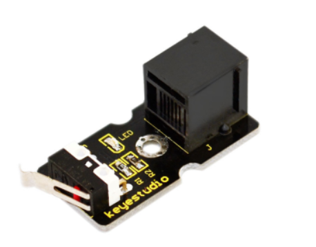
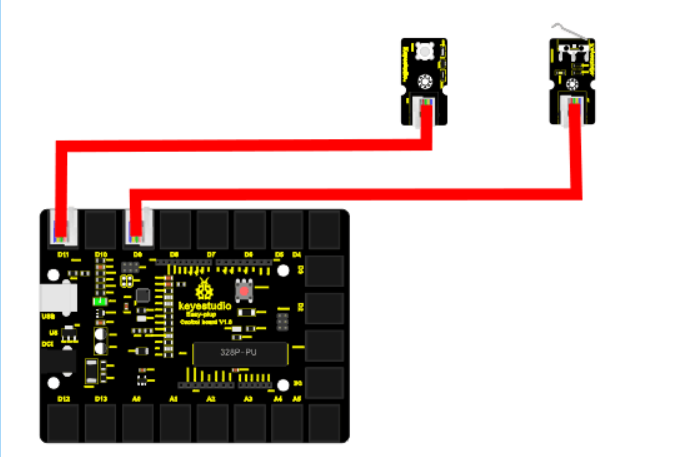

chapter 14: Collision detecting
========================================

충돌센서를 활용해 보자.
간단한 스위치 역할을 하지만 미니 자동차를 만들었을때 충돌 감지등에 유용하게 쓰인다.

14.1 준비물
-------------------------

EASY plug controller Board *1

EASY plug cable *2

USB cable *1

EASY plug Digital White LED Module *1

EASY plug Collision Sensor *1

센서 스펙은 다음과 같다.

With indicator light

Size: 39 * 20mm

Weight: 7g

14.2 연결 설정
------------------------

디지털 LED는 9번을 사용하도록 하자
충돌 센서도 디지털 센서이므로 8번을 이용하도록 하자.

14.3 code
------------------------
블락코드는 다음과 같다.

.. image:: ./img/chapter14-3.png

아두이노 코드는 다음과 같다.
시리얼로 연결해서 값을 찍어 보면 적절히 충돌 센서 디지털 값을 확인할 수 있다.

.. code-block:: python

    void setup() {
      Serial.begin(19200);
      pinMode(8, INPUT);
      pinMode(9, OUTPUT);
    }

    void loop() {
      for (int count = 0; count < 10; count++) {
        if (false == digitalRead(8)) {
          digitalWrite(9, HIGH);
          Serial.println(true);
        } else {
          digitalWrite(9, LOW);
          Serial.println(false);
        }
        delay(1000);
      }

    }

