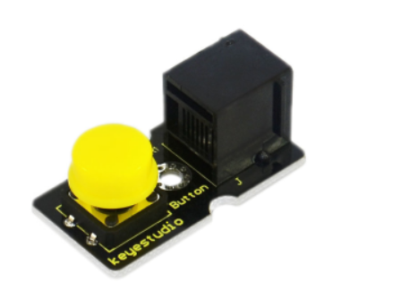
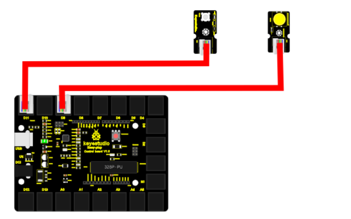
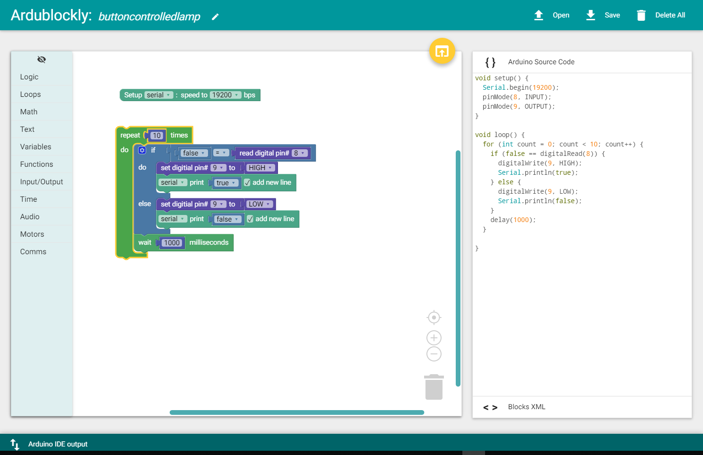

chapter 15: Button-controlled lamp
========================================

이전장에서 여러가지 LED를 On-Off 하는 센서를 다루었다 .
여기서는 직관적으로 간단한 버튼 스위치를 넣어서 LED를 On-Off 해보도록 하겠다.

15.1 준비물
-------------------------

EASY plug controller Board *1
EASY plug cable *2
USB cable *1
EASY plug Digital White LED Module *1
EASY plug Digital Push Button *1

버튼 스위치의 스펙은 다음과 같다.

Supply Voltage: 3.3V to 5V
Easy to 'plug and play'
Large button and high-quality first-class cap
Interface: Digital

디지털 스위치이다.

15.2 연결 설정
------------------------

디지털 LED는 9번을 사용하도록 하자
버튼 센서도 디지털 센서이므로 8번을 이용하도록 하자.

15.3 code
------------------------
블락코드는 다음과 같다.

아두이노 코드는 다음과 같다.
시리얼로 연결해서 값을 찍어 보면 적절히 버튼 센서 디지털 값을 확인할 수 있다.

.. code-block:: python

    void setup() {
      Serial.begin(19200);
      pinMode(8, INPUT);
      pinMode(9, OUTPUT);
    }

    void loop() {
      for (int count = 0; count < 10; count++) {
        if (false == digitalRead(8)) {
          digitalWrite(9, HIGH);
          Serial.println(true);
        } else {
          digitalWrite(9, LOW);
          Serial.println(false);
        }
        delay(1000);
      }

    }

