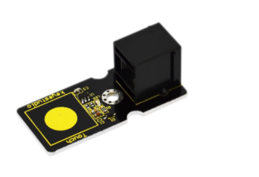
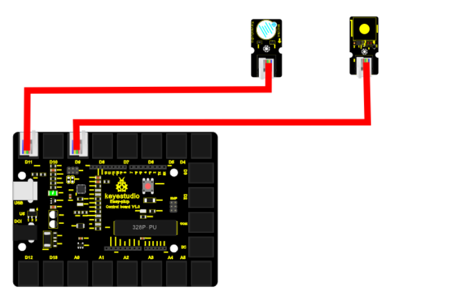
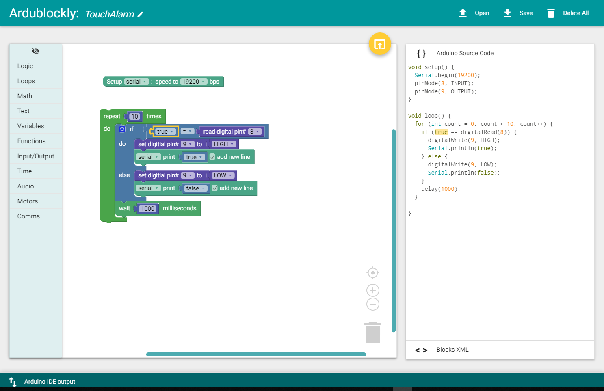

chapter 16: Touch alarm
==============================================

접촉센서에 대해서 알아보도록 하자.
전자세계에 오면 여러가지 센서들로 스위치를 대체하는 경우가 많다. 접촉센서도 이와 마찬가지이다.

16.1 준비물
-------------------------

EASY plug controller Board *1
EASY plug cable *2
USB cable *1
EASY plug Active Buzzer module *1
EASY plug Capacitive Touch Sensor *1

터치 센서 스펙을 보자

Supply Voltage: 3.3V to 5V
Interface: Digital
Size: 45*20mm
Weight: 5g

16.2 연결 설정
------------------------

디지털 LED는 9번을 사용하도록 하자
버튼 센서도 디지털 센서이므로 8번을 이용하도록 하자.

16.3 code
------------------------
블락코드는 다음과 같다.

아두이노 코드는 다음과 같다.
시리얼로 연결해서 값을 찍어 보면 적절히 터치 센서 디지털 값을 확인할 수 있다.

.. code-block:: python

    void setup() {
      Serial.begin(19200);
      pinMode(8, INPUT);
      pinMode(9, OUTPUT);
    }

    void loop() {
      for (int count = 0; count < 10; count++) {
        if (true == digitalRead(8)) {
          digitalWrite(9, HIGH);
          Serial.println(true);
        } else {
          digitalWrite(9, LOW);
          Serial.println(false);
        }
        delay(1000);
      }

    }

