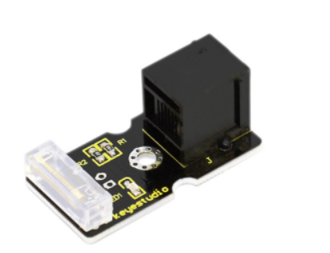
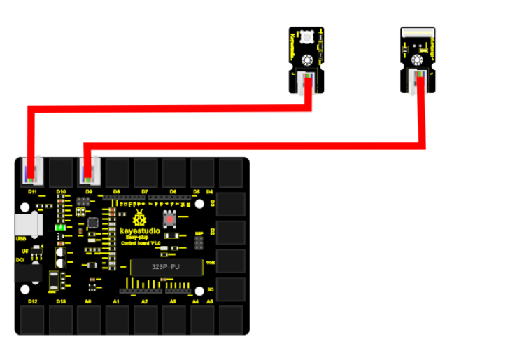
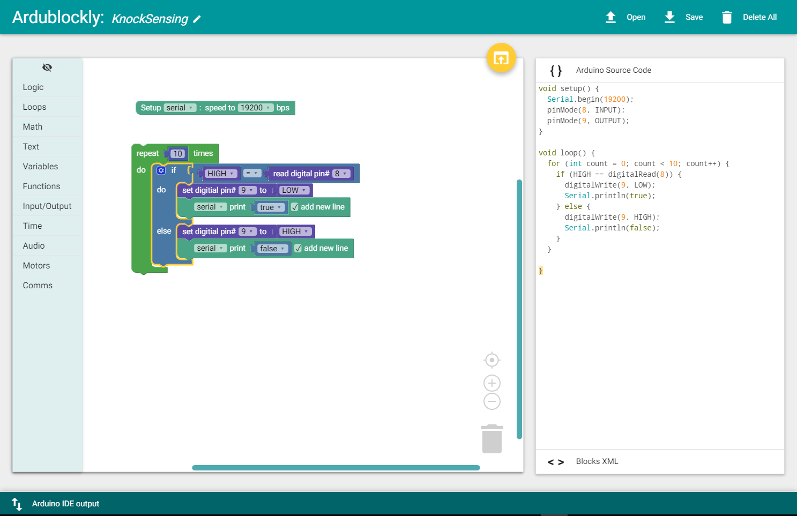

chapter 17: Knock Sensing
==============================================

노크에 대한 센싱을 하는 센서이다.
이 스위치는 노크에 대해서 스위치로도 쓰일수 있다.

17.1 준비물
-------------------------

EASY plug controller Board *1

EASY plug cable *2 USB cable *1

EASY plug Digital White LED Module *1

EASY plug Knock Sensor *1

센서 스펙을 보자

Working voltage: 5V

Size: 38*20mm

Weight: 5g

17.2 연결 설정
------------------------

디지털 LED는 9번을 사용하도록 하자
노크 센서도 디지털 센서이므로 8번을 이용하도록 하자.

17.3 code
------------------------
블락코드는 다음과 같다.

아두이노 코드는 다음과 같다.
시리얼로 연결해서 값을 찍어 보면 적절히 노크 센서 디지털 값을 확인할 수 있다.
노크센서가 정말 많이 해야 잠깐 동작하는 정도이다.

.. code-block:: python

    void setup() {
      Serial.begin(19200);
      pinMode(8, INPUT);
      pinMode(9, OUTPUT);
    }

    void loop() {
      for (int count = 0; count < 10; count++) {
        if (HIGH == digitalRead(8)) {
          digitalWrite(9, LOW);
          Serial.println(true);
        } else {
          digitalWrite(9, HIGH);
          Serial.println(false);
        }
      }

    }

