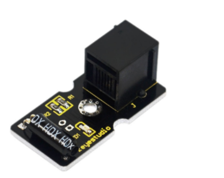
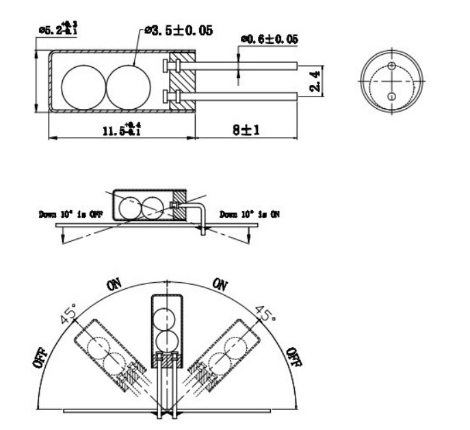
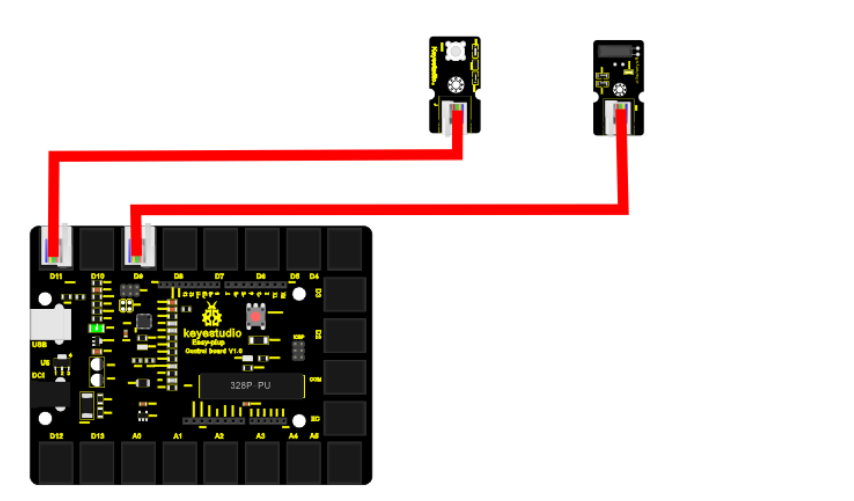

chapter 18: Tilt Sensor
==============================================

기울기  센서에 대해서 알아보도록 하자.
디지털 스위치 센서로서 센서안에 볼이 들어 있어서 위-아래에 동작에 따라서 on-off 스위치 역할을 한다.

18.1 준비물
-------------------------

EASY plug controller Board *1

EASY plug cable *2

USB cable *1

EASY plug Digital White LED Module *1

EASY plug Digital Tilt Sensor *1

센서 스펙을 보자
Supply Voltage: 3.3V to 5V

Interface: Digital

Size: 39*20mm

Weight: 5g

디지털 센서이다.
동작원리는 다음과 같다.

18.2 연결 설정
------------------------

디지털 LED는 9번을 사용하도록 하자
Tilt 센서도 디지털 센서이므로 8번을 이용하도록 하자.

18.3 code
------------------------
블락코드는 다음과 같다.

.. image:: ./img/chapter18-3.png

아두이노 코드는 다음과 같다.
시리얼로 연결해서 값을 찍어 보면 적절히 Tilt 센서 디지털 값을 확인할 수 있다.

.. code-block:: python

    void setup() {
      Serial.begin(19200);
      pinMode(8, INPUT);
      pinMode(9, OUTPUT);
    }

    void loop() {
      for (int count = 0; count < 10; count++) {
        if (HIGH == digitalRead(8)) {
          digitalWrite(9, HIGH);
          Serial.println(true);
        } else {
          digitalWrite(9, LOW);
          Serial.println(false);
        }
      }

    }

