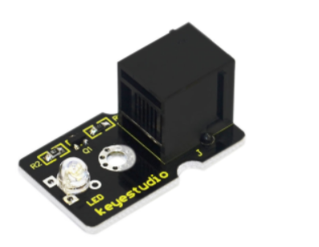
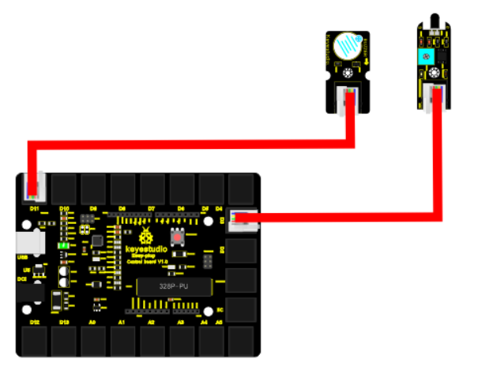

chapter 19: Fire alarm
==============================================

화재에 대한 경보 센서를 알아보자.

19.1 준비물
-------------------------

EASY plug controller Board *1
EASY plug cable *2
USB cable *1
Lighter *1 (not included)
EASY plug Active Buzzer module *1
EASY plug Flame Sensor *1

센서 스펙을 보자

Supply Voltage: 3.3V to 5V
Detection range: 500px (4.8V) ~ 2500px (1V)
Rang of Spectral Bandwidth: 760nm to 1100nm
Operating temperature: -25℃to 85℃
Interface: digital
Size: 49*16.7mm
Weight: 6g

19.2 연결 설정
------------------------

디지털 알람 센서를 9번을 이용하자
화염센서는 8번을 이용하자.
화염센서는 디지털 센서이다.

19.3 code
------------------------
블락코드는 다음과 같다.

.. image:: ./img/chapter19-3.png

아두이노 코드는 다음과 같다.
시리얼로 연결해서 값을 찍어 보면 적절히 화염 센서 디지털 값을 확인할 수 있다.

.. code-block:: python

    void setup() {
      Serial.begin(19200);
      pinMode(8, INPUT);
      pinMode(9, OUTPUT);
    }

    void loop() {
      for (int count = 0; count < 10; count++) {
        if (HIGH == digitalRead(8)) {
          digitalWrite(9, HIGH);
          Serial.println(true);
        } else {
          digitalWrite(9, LOW);
          Serial.println(false);
        }
      }

    }

