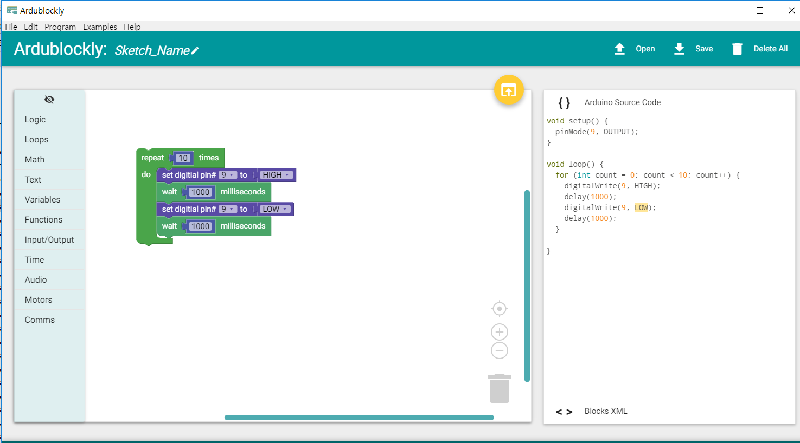

chapter 2: Who's blinking
===========================

LED 센서를 이용해 보자.
LED는 Digital Type으로 1 신호가 오면 켜지고 0 이 오면 커지는 특성을 가진다.

.. image:: ./img/chapter2-1.png

2.1 준비물
-------------------------

EASY plug controller Board *1

EASY plug cable *1

USB cable *1

EASY plug Digital White LED Module *1

2.2 연결 설정
------------------------

다음처럼 보드의 D2~13 임의의 포트에 끼워주면 된다.
여기서는 9번 포트로 설정해 보자.( 모터 드라이버가 10,11,12,13을 사용함으로 그쪽은 피한다)

.. image:: ./img/chapter2-2.png

2.3 code
------------------------

아두이노 코드는 다음과 같다.

.. code-block:: python

    void setup() {
      pinMode(9, OUTPUT);
    }

    void loop() {
      for (int count = 0; count < 10; count++) {
        digitalWrite(9, HIGH);
        delay(1000);
        digitalWrite(9, LOW);
        delay(1000);
      }

    }
블락코드는 다음과 같이 구성한다.
아두이노는 계속 루프가 돌기때문에 반복문을 안써도 되지만 블럭 구성상 반복을 구성해 보자.

