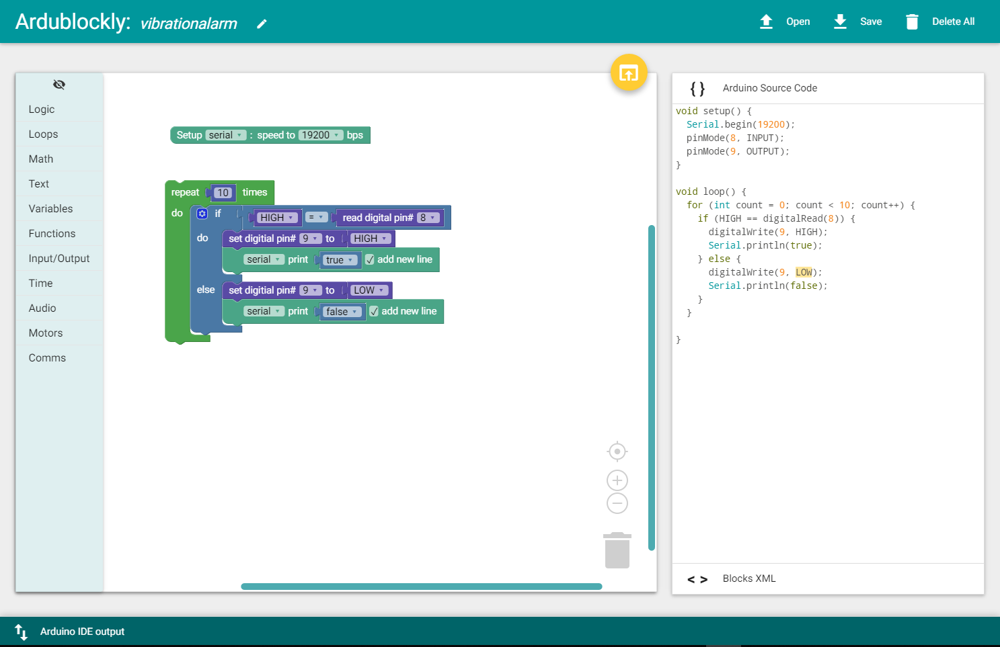

chapter 20: Vibration alarm
==============================================

진동 센서에 의한 알람을 만들어 보자.
이 센서는 어떤 보물이 있을때 그것을 훔쳐가지 못하도록 할때 진동을 감지해서 알람을 울리도록 하는것이다.

20.1 준비물
-------------------------

EASY plug controller Board *1

EASY plug cable *2

USB cable *1

EASY plug Active Buzzer module *1

EASY plug Vibration Sensor *1

센서 스펙을 보도록 하자.

IO Type: Digital

Supply Voltage: 3.3V to 5V

Size: 46.4*16.6mm

Weight: 7g

디지털 센서이다.

20.2 연결 설정
------------------------

디지털 알람 센서를 9번을 이용하자
진동센서는 8번을 이용하자.

20.3 code
------------------------
블락코드는 다음과 같다.

아두이노 코드는 다음과 같다.
시리얼로 연결해서 값을 찍어 보면 적절히 진동 센서 디지털 값을 확인할 수 있다.

.. code-block:: python

    void setup() {
      Serial.begin(19200);
      pinMode(8, INPUT);
      pinMode(9, OUTPUT);
    }

    void loop() {
      for (int count = 0; count < 10; count++) {
        if (HIGH == digitalRead(8)) {
          digitalWrite(9, HIGH);
          Serial.println(true);
        } else {
          digitalWrite(9, LOW);
          Serial.println(false);
        }
      }

    }

