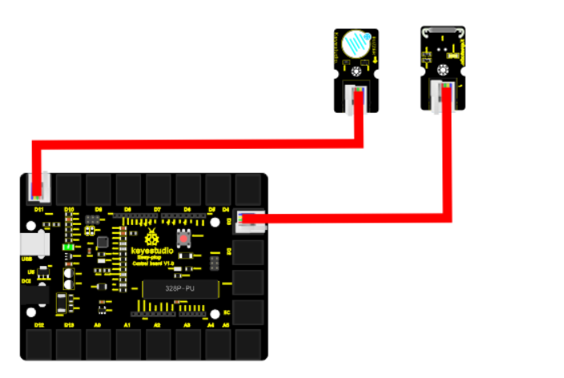

chapter 21: Magnetic field detector
==============================================

13장에서 마그네틱 센서를 배웠는데 여기서도 비슷한 센서이다.
그렇지만 다른 모듈을 사용하여 다른 결과값이 나오는 센서이다.
리드 스위치는 특별한 스위치인데 스위치 사이에 소프트 마그네틱 물질로 구성되어 있고 마그네틱값이 있을때와 좀 멀리 떨어졌을때의
차이를 이용한다.
따라서 센서 스펙에서 알수 있듯이 거리에 대한 전류치가 가장 중요하다.

21.1 준비물
-------------------------

EASY plug controller Board *1
EASY plug cable *2
USB cable *1
Magnetic-iron *1 (not included)
EASY plug Active Buzzer module *1
EASY plug Reed Switch Module *1

센서 스펙을 보자.
Working voltage: DC 3.3V-5V
Working current: ≥20mA
Working temperature: －10℃—＋50℃
Detection distance: ≤10mm
IO Interface: 3 wire interface (-/+/S)
Size: 39*20mm
Weight: 5g

21.2 연결 설정
------------------------

디지털 알람 센서를 9번을 이용하자
마크네틱 센서는 8번을 이용하자.

21.3 code
------------------------
블락코드는 다음과 같다.

아두이노 코드는 다음과 같다.
시리얼로 연결해서 값을 찍어 보면 적절히 마그네틱 센서 디지털 값을 확인할 수 있다.

.. code-block:: python

    void setup() {
      Serial.begin(19200);
      pinMode(8, INPUT);
      pinMode(9, OUTPUT);
    }

    void loop() {
      for (int count = 0; count < 10; count++) {
        if (HIGH == digitalRead(8)) {
          digitalWrite(9, HIGH);
          Serial.println(true);
        } else {
          digitalWrite(9, LOW);
          Serial.println(false);
        }
      }

    }

