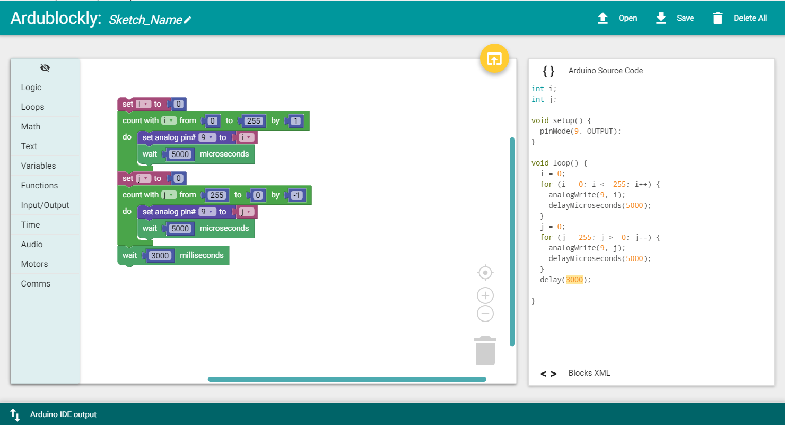

chapter 3: Visible breath
============================

LED 센서를 이용해 보자.
여기서는 LED가 숨쉬는것 같은 동작을 구현해 보자.

.. image:: ./img/chapter2-1.png

3.1 준비물
-------------------------

EASY plug controller Board *1

EASY plug cable *1

USB cable *1

EASY plug Digital White LED Module *1

3.2 연결 설정
------------------------

여기서는 9번 포트로 설정해 보자.

.. image:: ./img/chapter2-2.png

3.3 code
------------------------
블럭코드는 다음과 같다.
숨쉬는 효과를 줄려면 타이머를 좀 늘리면 좀 더 확인할 수 있다.
짧은 시간 타이머를 넣으면 LED 깜박은 효과와 비슷하다.

아두이노 코드는 다음과 같다.

.. code-block:: python

    int i;
    int j;

    void setup() {
      pinMode(9, OUTPUT);
    }

    void loop() {
      i = 0;
      for (i = 0; i <= 255; i++) {
        analogWrite(9, i);
        delayMicroseconds(5000);
      }
      j = 0;
      for (j = 255; j >= 0; j--) {
        analogWrite(9, j);
        delayMicroseconds(5000);
      }
      delay(3000);

    }

