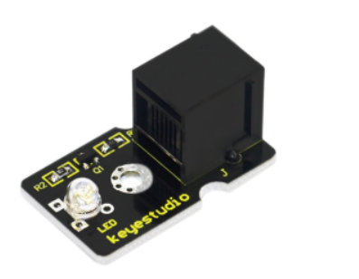

chapter 4: Flowing light
===========================

LED 센서를 이용해 보자.
3개의 LED를 이용하여 날아가는 효과를 한번 구현해 보자.

4.1 준비물
-------------------------

EASY plug controller Board *1

EASY plug cable *3

USB cable *1

EASY plug Digital White LED Module *3

4.2 연결 설정
------------------------

다음처럼 보드의 D2~13 임의의 포트에 끼워주면 된다.
여기서는 7,8,9번 포트로 설정해 보자.

4.3 code
------------------------
블럭코드는 다음과 같다.
숨쉬는 효과를 줄려면 타이머를 좀 늘리면 좀 더 확인할 수 있다.
짧은 시간 타이머를 넣으면 LED 깜박은 효과와 비슷하다.

.. image:: ./img/chapter4-2.png

아두이노 코드는 다음과 같다.

.. code-block:: python

    int i;

    void setup() {
      pinMode(7, OUTPUT);
      pinMode(8, OUTPUT);
      pinMode(9, OUTPUT);
    }

    void loop() {
      i = 0;

      for (i = 1; i <= 3; i++) {
        digitalWrite(7, HIGH);
        delay(200);
        digitalWrite(8, HIGH);
        delay(200);
        digitalWrite(9, HIGH);
        delayMicroseconds(200);
      }
      for (i = 1; i <= 3; i++) {
        digitalWrite(7, LOW);
        delay(200);
        digitalWrite(8, LOW);
        delay(200);
        digitalWrite(9, LOW);
        delayMicroseconds(200);
      }

    }
4.4 유튜브 동영상
------------------------

https://youtu.be/-ACYRcyZi4E