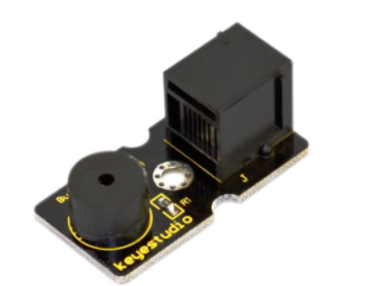
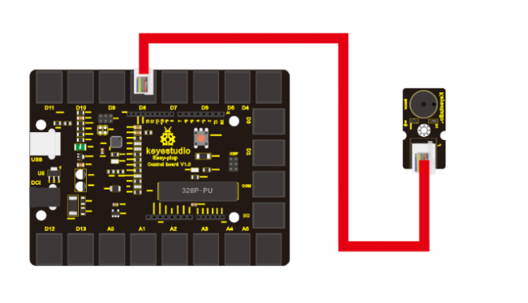
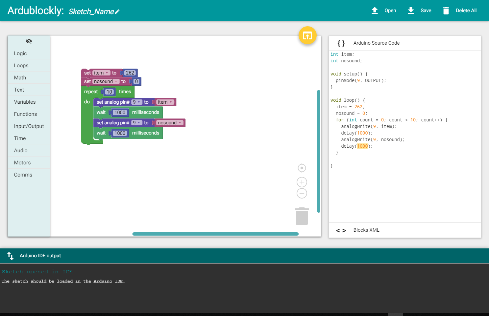

chapter 6: Who's singing
==========================

패시브 부저 센서를 사용해 보자.
앞장으 액티브 부저와 다른점은 디지털 신호에 동작하지 않는다는 것이다.
2K~5K 주파수만이 음을 낼 수가 있다.

6.1 준비물
-------------------------

EASY plug controller Board *1
EASY plug cable *1
USB cable *1
EASY plug Passive Buzzer module *1

6.2 연결 설정
------------------------

다음처럼 보드의 D2~13 임의의 포트에 끼워주면 된다.
여기서는 9번 포트로 설정해 보자.

6.3 code
------------------------
이 부분은 블락코드 기본 코드만 제공한다.
기타 제공 코드는 수식을 넣어야 돼서 아두이노 기본 코드로 한다.
다음은 한가지 소리만 내는것을 반복하도록 해보자.
기본 코드는 다음과 같다.

.. code-block:: python

    int item;

    void setup() {
      pinMode(9, OUTPUT);
    }

    void loop() {
      item = 262;
      for (int count = 0; count < 10; count++) {
        analogWrite(9, item);
        delay(1000);
      }

    }

프로젝트 아두이노 코드는 다음과 같다.

.. code-block:: python

    #define D0 -1
    #define D1 262
    #define D2 293
    #define D3 329
    #define D4 349
    #define D5 392
    #define D6 440
    #define D7 494

    #define M1 523
    #define M2 586
    #define M3 658
    #define M4 697
    #define M5 783
    #define M6 879
    #define M7 987

    #define H1 1045
    #define H2 1171
    #define H3 1316
    #define H4 1393
    #define H5 1563
    #define H6 1755
    #define H7 1971
    // List all D tune frequency
    #define WHOLE 1
    #define HALF 0.5
    #define QUARTER 0.25
    #define EIGHTH 0.25
    #define SIXTEENTH 0.625
    // list all tempos
    int tune[]=        // List each frequency according to numbered musical notation
    {
      M3,M3,M4,M5,
      M5,M4,M3,M2,
      M1,M1,M2,M3,
      M3,M2,M2,
      M3,M3,M4,M5,
      M5,M4,M3,M2,
      M1,M1,M2,M3,
      M2,M1,M1,
      M2,M2,M3,M1,
      M2,M3,M4,M3,M1,
      M2,M3,M4,M3,M2,
      M1,M2,D5,D0,
      M3,M3,M4,M5,
      M5,M4,M3,M4,M2,
      M1,M1,M2,M3,
      M2,M1,M1
    };
    float durt[]=       // list all tempo according to numbered musical notation
    {
      1,1,1,1,
      1,1,1,1,
      1,1,1,1,
      1+0.5,0.5,1+1,
      1,1,1,1,
      1,1,1,1,
      1,1,1,1,
      1+0.5,0.5,1+1,
      1,1,1,1,
      1,0.5,0.5,1,1,
      1,0.5,0.5,1,1,
      1,1,1,1,
      1,1,1,1,
      1,1,1,0.5,0.5,
      1,1,1,1,
      1+0.5,0.5,1+1,
    };
    int length;
    int tonepin=7;   // set module signal pin to D8
    void setup()
    {
      pinMode(tonepin,OUTPUT);
      length=sizeof(tune)/sizeof(tune[0]);   // calculate length

    }
    void loop()
    {
      for(int x=0;x<length;x++)
      {
        tone(tonepin,tune[x]);
        delay(500*durt[x]);   // this is use to adjust tempo delay, you can change the number to your liking.
        noTone(tonepin);
      }
      delay(2000);
    }

     void tone(int pin,int tune)
    {
      analogWrite(9, tune);
    }
    void noTone(int pin)
    {
      analogWrite(9, 0);
}

