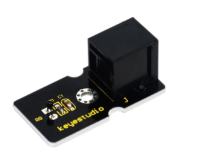
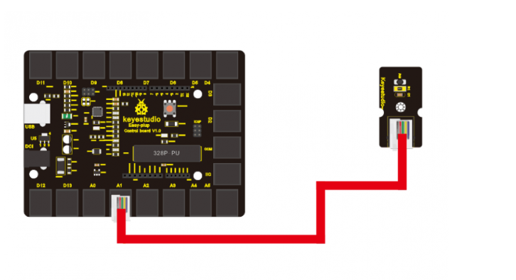
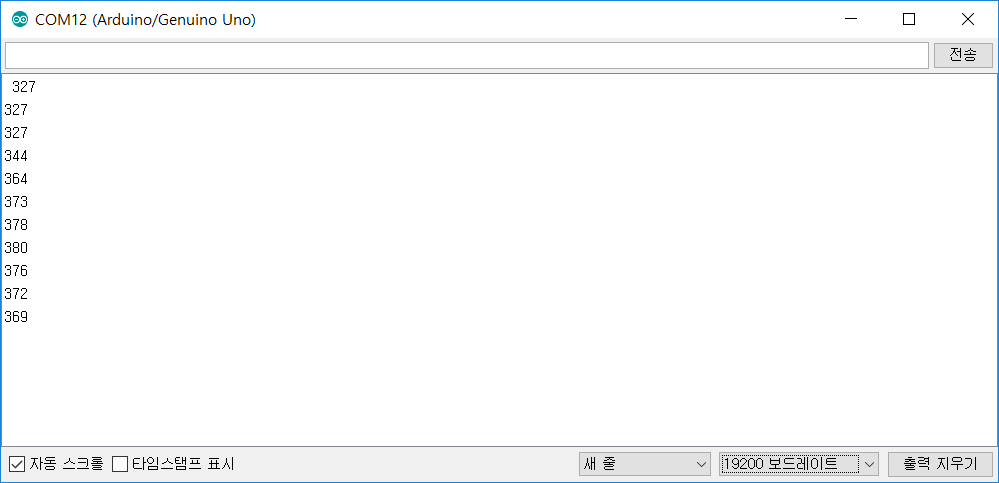
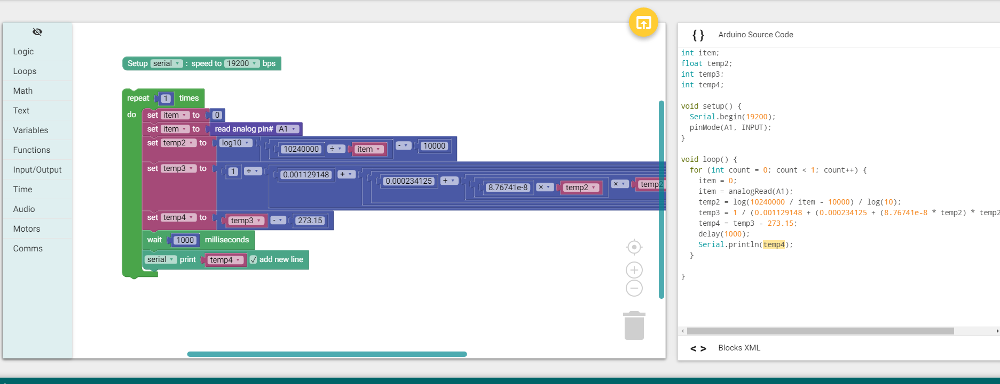

chapter 7: Temperature measuring
========================================

온도 센서를 이용해서 온도를 측정해 보자.
주위의 온도가 차갑도 따듯한 것을 어떻게 알아 낼 수 있을까 한번 배워 보자.
센서는 아래와 같다.
아날로드 센서는 온도 센서의 기본이며 센서값을 보드로 전달하게 된다.

Interface type: analog
Working voltage: 5V
Temperature range: -55℃～315℃
Size: 38*20mm
Weight: 5g

7.1 준비물
-------------------------

EASY plug controller Board *1
EASY plug cable *1
USB cable *1
EASY plug Analog Temperature Sensor *1

7.2 연결 설정
------------------------

다음처럼 보드의 D2~13 임의의 포트에 끼워주면 된다.
아날로드 센서값은 A0~A5를 이용한다.
여기서는 A1번 포트로 설정해 보자.

7.3 code
------------------------

블락  코드는 다음과 같다.
아날로드 센서값을 바로 온도값으로 쓸수는 없다.
센서에서 받은 값을 수식을 통해 계산한후 다시 섭씨 온도로 변환을 한다.
일단 아날로드 센서 값을  읽어 보자.
첫장에서 배운것처럼 Arduino IDE를 통해 시리얼로 값을 읽는 것을 해보도록 하자.

높은값이 표시되는것을 알수 있다.
수식 계산은 아래와 같다.

double Thermister(int RawADC)
{
double Temp;
Temp = log(((10240000/RawADC) - 10000));
Temp = 1 / (0.001129148 + (0.000234125 + (0.0000000876741 * Temp * Temp ))* Temp );
Temp = Temp - 273.15; // Convert Kelvin to Celcius
return Temp;
}
좀더 보정된 값을 찍어 보도록 하자.
데이터 타입이 변환이 정확지 않아 숫자값이 정확하지 않다.
아날로그 센서값은 다양하게 값이 변하므로 좀 튜닝이 필요하다.

프로젝트 아두이노 코드는 다음과 같다.

.. code-block:: python

     int item;
    float temp2;
    int temp3;
    int temp4;

    void setup() {
      Serial.begin(19200);
      pinMode(A1, INPUT);
    }

    void loop() {
      for (int count = 0; count < 1; count++) {
        item = 0;
        item = analogRead(A1);
        temp2 = log(10240000 / item - 10000) / log(10);
        temp3 = 1 / (0.001129148 + (0.000234125 + (8.76741e-8 * temp2) * temp2) * temp2);
        temp4 = temp3 - 273.15;
        delay(1000);
        Serial.println(temp4);
      }

    }

