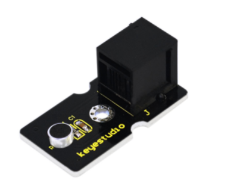
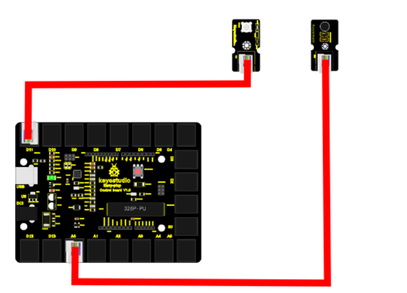
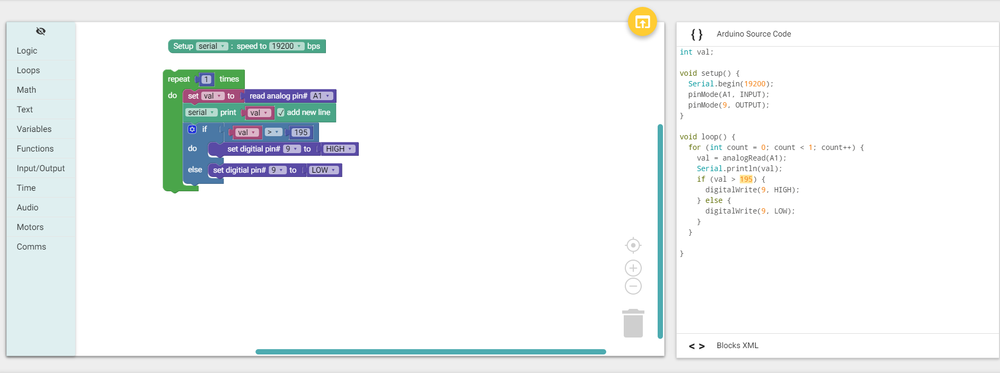

chapter 8: Make a sound-controlled lamp
==========================================

아날로그 사운드 센서와 LED를 사용하여
일정값 이상의 소리가 나오면 LED가 켜지는 테스트를 해보자.

8.1 준비물
-------------------------

EASY plug controller Board *1
EASY plug cable *1
USB cable *1
EASY plug Digital White LED Module *1
EASY plug Analog Sound Sensor *1

8.2 연결 설정
------------------------

LED 센서는 9번 포트를 이용하고
소리 센서는 아날로드 A1을 이용하자.

8.3 code
------------------------
블락코드는 다음과 같다.

아두이노 코드는 다음과 같다.
시리얼로 연결해서 값을 찍어 보면 192값이 계속 찍히는 것을 볼 수 있다.
따라서 값을 195정도로 잡았다.

.. code-block:: python

    int val;

    void setup() {
      Serial.begin(19200);
      pinMode(A1, INPUT);
      pinMode(9, OUTPUT);
    }

    void loop() {
      for (int count = 0; count < 1; count++) {
        val = analogRead(A1);
        Serial.println(val);
        if (val > 195) {
          digitalWrite(9, HIGH);
        } else {
          digitalWrite(9, LOW);
        }
      }

    }

