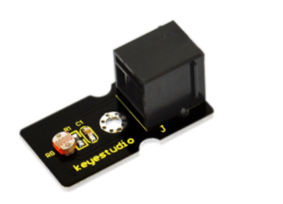
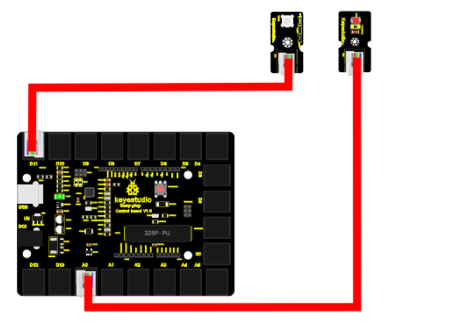
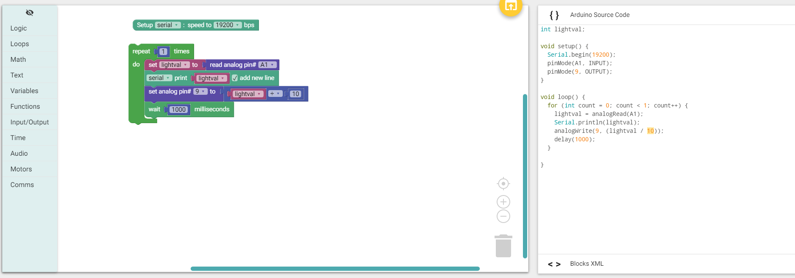

chapter 9: Make a light-controlled lamp
===========================================

빛을 감지하는 센서를 이용해 보자.
아날로그 빛 감지양에 따라서 LED를 On Off 해보도록 하자.

9.1 준비물
-------------------------

EASY plug controller Board *1

EASY plug cable *2

USB cable *1

EASY plug Digital White LED Module *1

EASY plug Photocell Sensor *1

9.2 연결 설정
------------------------

LED 센서는 9번 포트를 이용하고
빛감지 센서는 아날로드 A1을 이용하자.

9.3 code
------------------------
블락코드는 다음과 같다.

아두이노 코드는 다음과 같다.
시리얼로 연결해서 값을 찍어 보면 적절히 빛의 값에 따라서 동작을 해야 한다.

.. code-block:: python

    int lightval;

    void setup() {
      Serial.begin(19200);
      pinMode(A1, INPUT);
      pinMode(9, OUTPUT);
    }

    void loop() {
      for (int count = 0; count < 1; count++) {
        lightval = analogRead(A1);
        Serial.println(lightval);
        analogWrite(9, (lightval / 10));
        delay(1000);
      }

    }